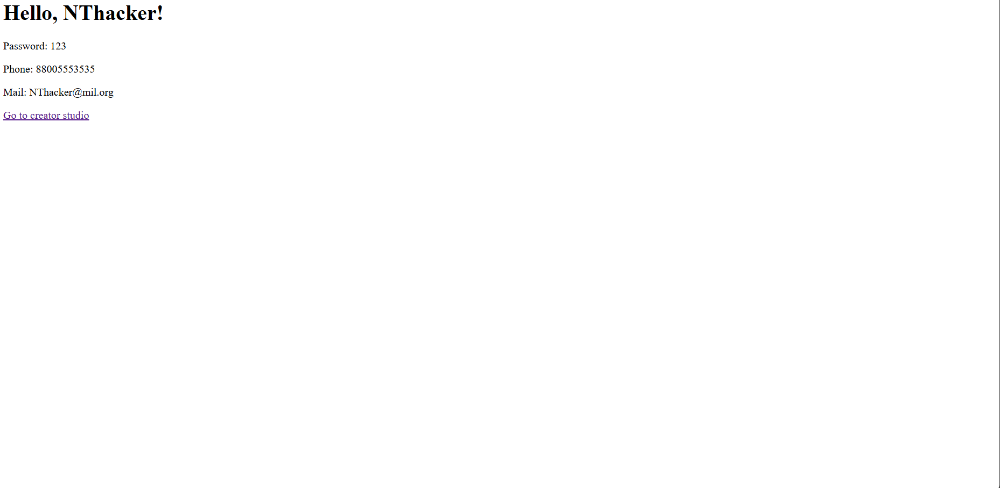
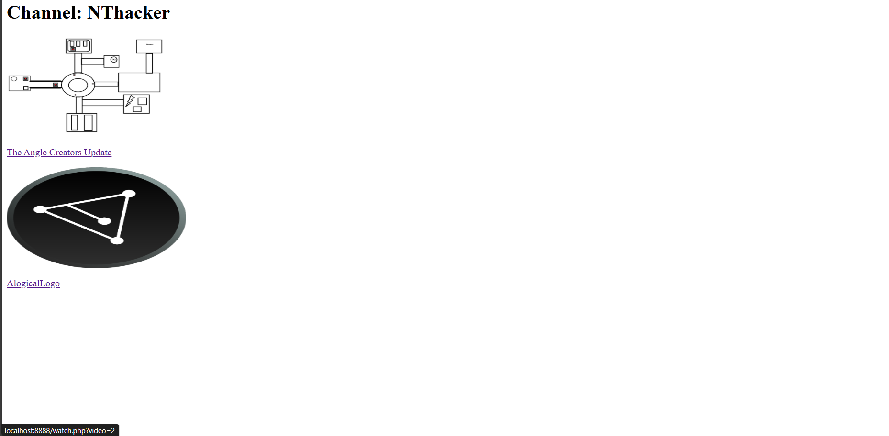

<h1>FreeTube</h1>
 
 
 
 
 
 
 

Features:
<ol>
	<li>Creator Studio - upload videos, add titles and descriptions</li>
	<li>Watch page - watch a videos</li>
	<li>Main Page - Choose a lot of videos</li>
	<li>Free code - download and use in your projects</li>
</ol>

<b>How to boot up your FreeTube copy</b>
<ol>
	<li>Download XAMPP from <a href="https://www.apachefriends.org/ru/index.html">link</a></li>
	<li>Set Up like this <a href="https://www.youtube.com/watch?v=MEpAXkQBEDs&ab_channel=loftblog">video</a> (if you use linux - skip)</li>
	<li>Jump to C:\xampp\htdocs\YOUR_FOLDER (Linux: C:\lampp\htdocs\YOUR_FOLDER) and execute in terminal from folder (if Windows - download git first) <pre>git clone "http://github.com/NThacker5246/FreeTube.git"</pre></li>
	<li>Copy all files from FreeTube to htdocs\YOUR_FOLDER</li>
	<li>Go to http://localhost:8888 (Linux: http://localhost:8080 or http://localhost:80) and use as you wish</li>
</ol>

<i>Official youtube <a>site</a> (Then I'll add link)</i>
