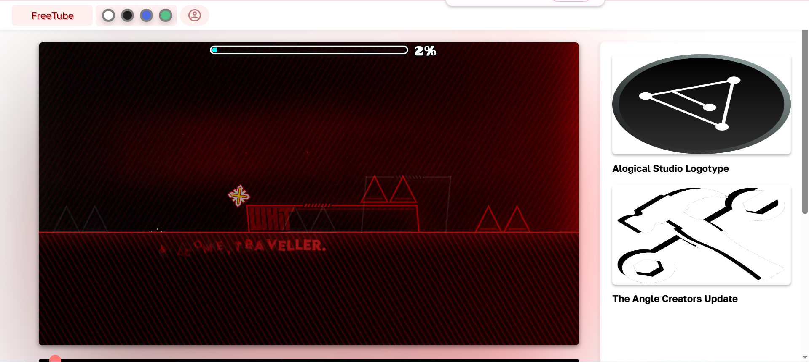
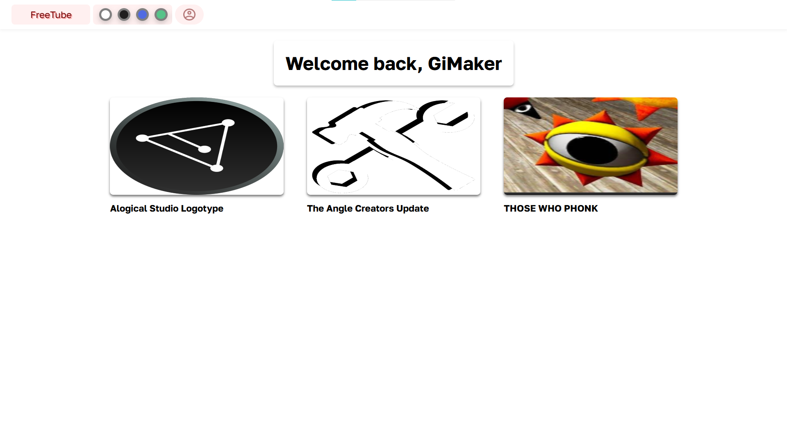
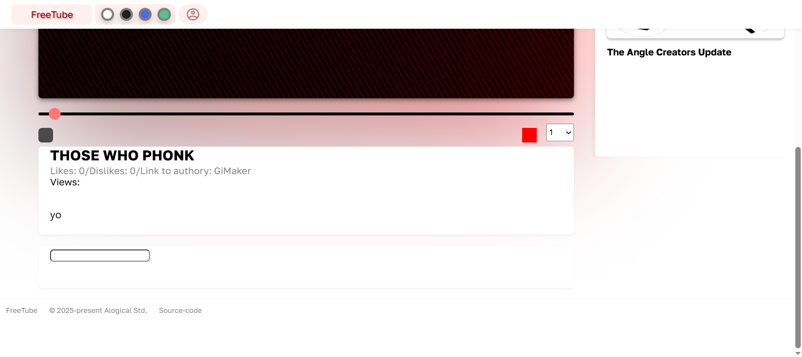

<h1>FreeTube</h1>
 
 
 
 

Features:
<ol>
	<li>Creator Studio - upload videos, add titles and descriptions</li>
	<li>Watch page - watch a videos</li>
	<li>Homepage - things that are delightfull for your taste!</li>
	<li>Open Source - download and use in your projects</li>
	<li>Analytics - analyse which content is more interesting to viewers</li>
</ol>

<b>How to boot up your FreeTube copy</b>
<ol>
	<li>Download XAMPP from a <a href="https://www.apachefriends.org/ru/index.html">link</a></li>
	<li>Set it up. <a href="https://www.youtube.com/watch?v=MEpAXkQBEDs&ab_channel=loftblog">Here's videotutorial</a> (if you use linux - skip)</li>
	<li>Jump to C:\xampp\htdocs\YOUR_FOLDER (Linux: C:\lampp\htdocs\YOUR_FOLDER) and clone FreeTube repistory (if Windows - download git first) <pre>git clone "http://github.com/NThacker5246/FreeTube"</pre></li>
	<li>Move all files from FreeTube to htdocs\YOUR_FOLDER</li>
	<li>Go to http://localhost:8888 (Linux: http://localhost:8080 or http://localhost:80) or other local adress and use as you wish</li>
</ol>

If you have questions left please visit our <a href="https://github.com/NThacker5246/FreeTube/wiki">wiki</a>

By any problems please report at alogicalstd@gmail.com

Join Alogical Community <a href="https://discord.gg/WCCEJFfbwx">Discord Server!</a>
